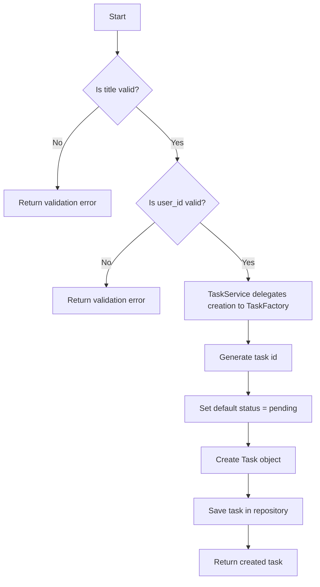

```mermaid
flowchart TD
    A[Start] --> B{Is title valid?}

    B -- No --> C[Return validation error]

    B -- Yes --> D{Is user_id valid?}

    D -- No --> E[Return validation error]

    D -- Yes --> F[TaskService delegates creation to TaskFactory]

    F --> G[Generate task id]

    G --> H[Set default status = pending]

    H --> I[Create Task object]

    I --> J[Save task in repository]

    J --> K[Return created task]
```