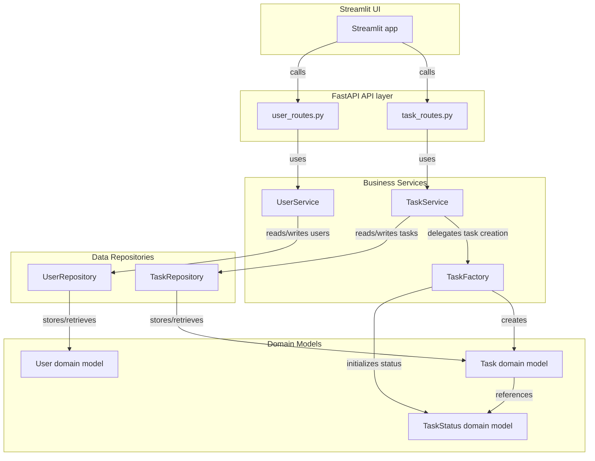

# System Architecture

## Architecture Overview

This diagram shows the high-level structure of the Task Management Service using a layered architecture.

- **Streamlit UI**: The front-end interface in `streamlit_app.py`. It sends user actions to API endpoints.
- **FastAPI API layer**: The HTTP routing layer in `src/api/task_routes.py` and `src/api/user_routes.py`. It receives requests from the UI and forwards them to service classes.
- **Services layer**: Business logic lives in `src/services/task_service.py`, `src/services/user_service.py`, and the task creation helper in `src/services/create_task/task_factory.py`.
- **Repositories layer**: Data access abstractions are defined in `src/repositories/task_repository.py` and `src/repositories/user_repository.py`. They manage in-memory storage and retrieval of domain objects.
- **Domain models**: Core data entities are defined in `src/domain/task.py`, `src/domain/user.py`, and `src/domain/task_status.py`. These models represent the task and user data structures.

### Request flow

1. A user action originates in the **Streamlit UI** and calls a FastAPI endpoint.
2. The **API layer** receives the request and invokes the appropriate service.
3. The **Service layer** applies business logic and delegates work:
   - `TaskService` may use `TaskFactory` to build new task objects.
   - `TaskService` and `UserService` use repositories to persist or fetch domain entities.
4. The **Repository layer** reads/writes domain models.
5. The domain models, including `Task`, `User`, and `TaskStatus`, represent the structured data flowing through the system.
6. A response is returned back through the service and API layers to the UI.
